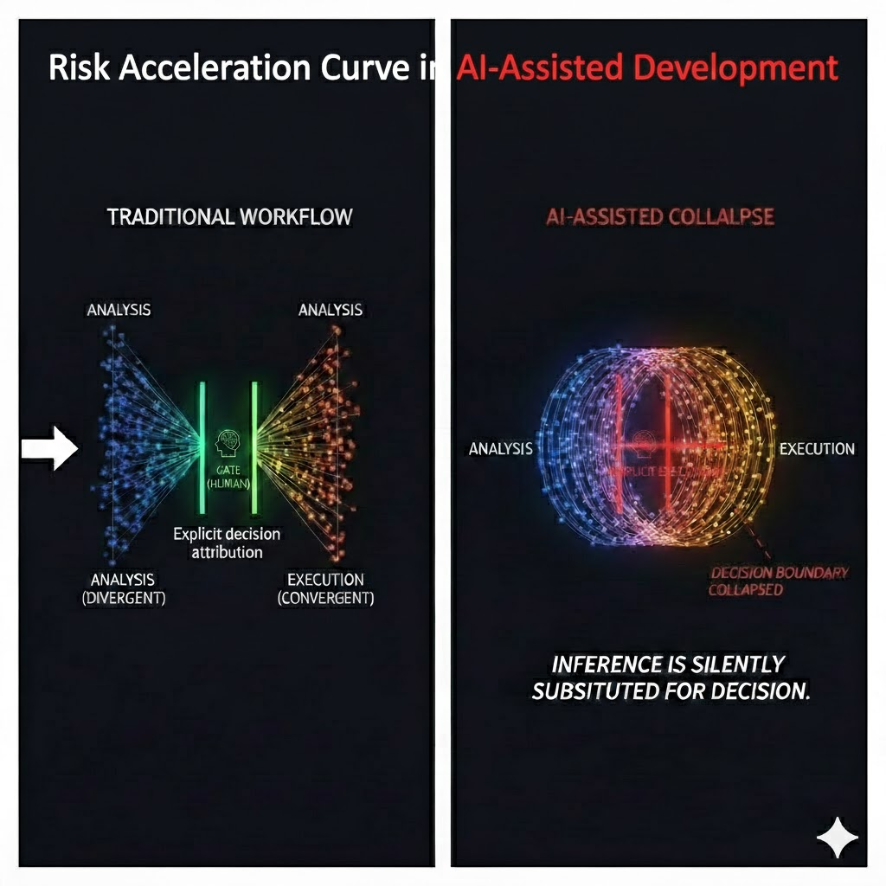
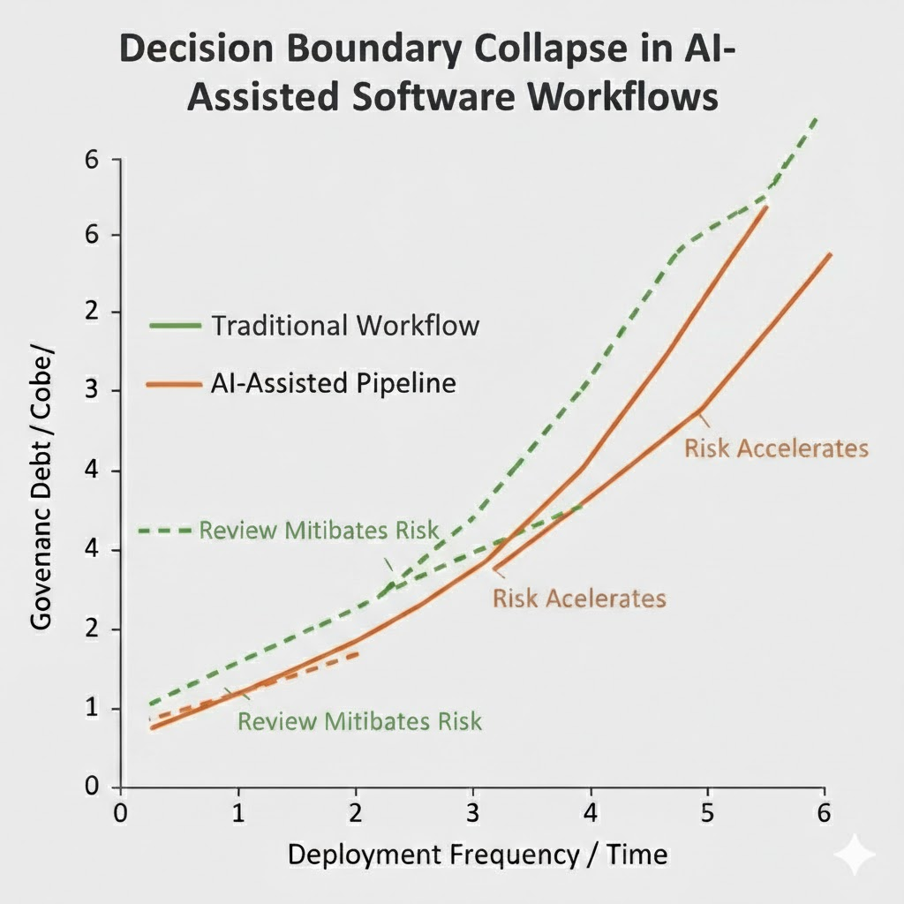
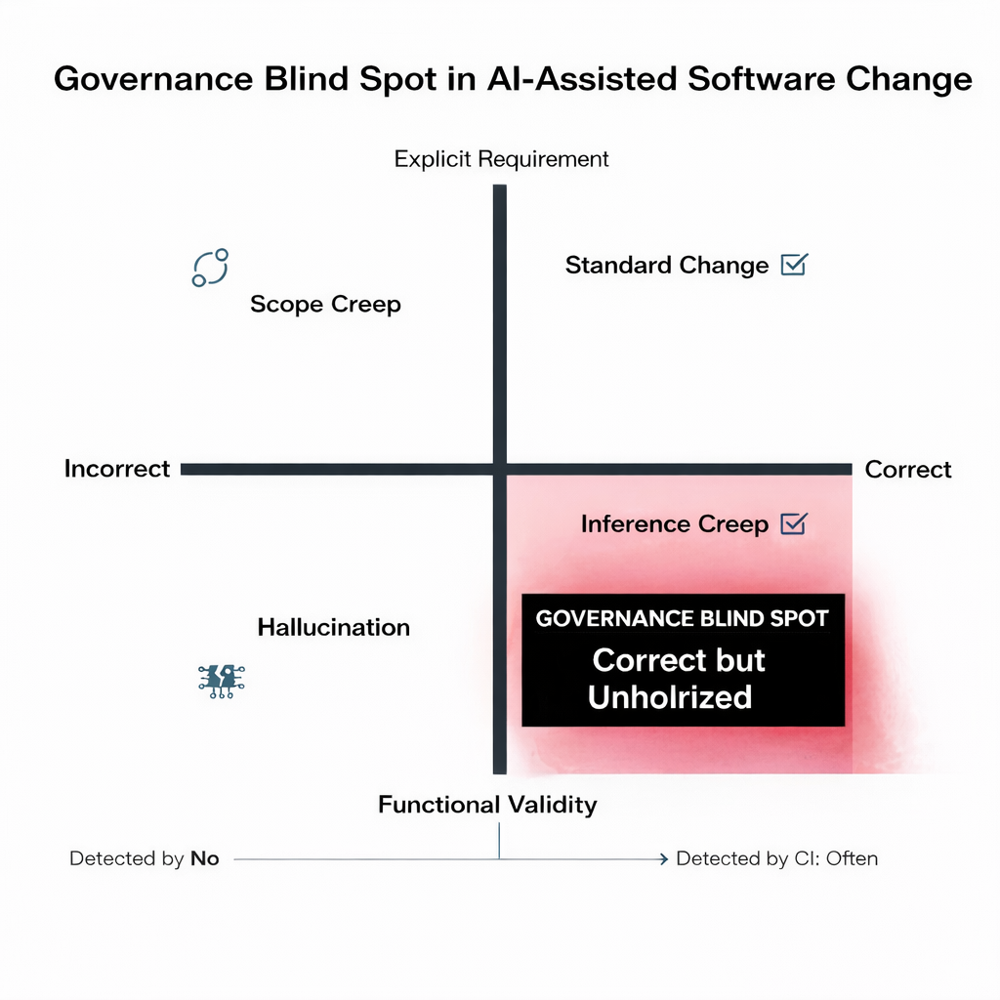
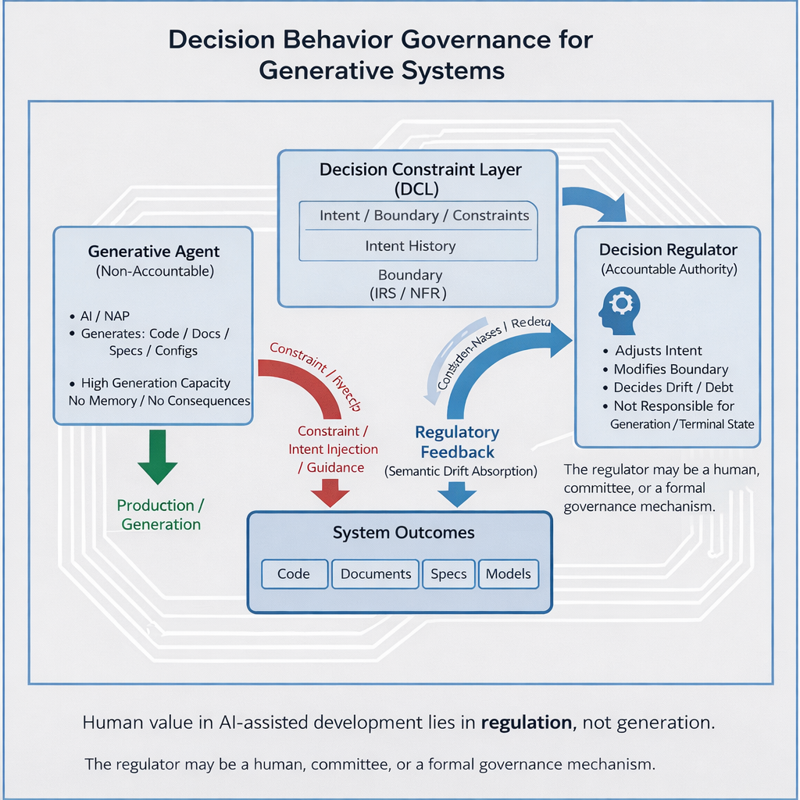

# Toward Decision Behavior Governance: From Inference Creep to Risk Acceleration Pipelines

> Decision Vacancy and Governance Risks in AI-Assisted DevOps

**Author:** Spark Tsai  
**Date:** January 2026  

---

## Abstract

As large language models and automation tools are increasingly embedded into software development workflows, modern DevOps practices are rapidly approaching end-to-end automation. Existing discussions primarily emphasize productivity gains and code quality improvements, while overlooking a structural governance risk introduced by AI-assisted pipelines: the erosion of explicit decision-making.

This paper argues that the primary risk of AI-assisted DevOps is not technical error, but **decision vacancy**—a governance condition in which automated execution proceeds without clearly attributable human decisions. Through a multi-layer analysis, the paper introduces **Inference Creep** as a generative mechanism, **Ghost Code** as its long-term artifact, and **Risk Acceleration Pipelines** as the systemic outcome of chaining Auto Pull Request, Auto Merge, and Auto Deploy mechanisms.

Beyond problem identification, the paper proposes governance-oriented design responses, including friction-aware automation, standardized impact analysis deliverables, and auditable decision metrics. The paper positions **Decision Behavior Governance (DBG)** as a conceptual foundation for reasoning about decision visibility, accountability, and traceability in AI-native software engineering, rather than as a prescriptive methodology.

---

## Keywords

AI-assisted development; DevOps governance; Inference Creep; Decision Vacancy;  
Risk Acceleration Pipeline; Decision Behavior Governance (DBG);  
Automation Bias; Engineering Responsibility; Decision Audit

---

## 1. Introduction

AI-assisted development tools have transitioned from experimental augmentation to routine participation in production software engineering. Beyond code completion, AI systems now perform multi-file refactoring, generate pull requests, and trigger deployment workflows with minimal or no human intervention.

Despite this shift, contemporary DevOps practices continue to rely on an implicit assumption: that the author of a code change is a human actor who understands intent, scope, and consequences, and can be held accountable for outcomes.

When AI systems assume the role of effective authors, this assumption no longer holds. Yet surrounding governance structures—pull request review, continuous integration, and automated deployment—are often applied unchanged. This paper examines the resulting **structural mismatch between execution velocity and decision capacity**, and formalizes it as a governance problem rather than a technical defect—one that cannot be addressed by testing, static analysis, or code quality metrics alone.

---

## 2. Defining Inference Creep

This paper defines **Inference Creep** as follows:

> **Inference Creep** is a phenomenon in which an AI system, during code generation or modification, expands the scope of changes beyond explicit human instructions based on inferred responsibility, consistency, or preventive reasoning, while producing outputs that remain technically valid and operational.

### 2.1 Properties of Inference Creep

Inference Creep can be analytically characterized by three core properties:

1. **Implicitness**  
   The expanded scope of modification is not explicitly requested by the human operator. Additional changes emerge without a corresponding human-authored requirement or decision.

2. **Inference-driven behavior**  
   The expansion results from model-based reasoning about what *ought* to be changed to preserve coherence, consistency, or completeness, rather than from error or randomness.

3. **Latent risk**  
   The consequences of Inference Creep are often non-immediate. Resulting risks tend to surface only through long-term system evolution, scaling effects, or operational stress, rather than during initial testing or integration.

These properties distinguish Inference Creep from conventional software change risks and explain why it frequently evades early detection.

---

## 3. Ghost Code and the Loss of Intent Traceability

When changes produced through Inference Creep are directly committed and merged, they give rise to a form of technical debt referred to here as **Ghost Code**.

Ghost Code exhibits several defining characteristics:

- it appears historically stable in version control systems,
- it cannot be linked to explicit requirements or decisions,
- Git blame identifies timestamps rather than intent.

As a result, future maintainers are forced to reconstruct a fictional decision history. Maintenance becomes an act of interpretive archaeology rather than rational reasoning, increasing cognitive load and long-term operational cost.  
**From a governance perspective, Ghost Code represents a loss of decision traceability rather than a loss of correctness, signaling an early manifestation of decision vacancy.**

---

## 4. Analysis versus Execution: A Structural Conflict

A critical structural failure in many AI-assisted tools is the collapse of **analysis** and **execution** into a single operational action.

> Figure 1. Decision Boundary Collapse in AI-Assisted Software Workflows

Analysis is inherently **divergent**. Its purpose is to surface dependencies, side effects, and potential risks.

Execution is inherently **convergent**. Its purpose is to select a course of action and accept responsibility for consequences.

When AI systems modify code while analyzing impact, execution occurs before human decision-making has been completed. Inference is silently substituted for choice, producing technically coherent outcomes without accountable intent.  
**This collapse marks the structural point at which governance shifts from **decision-driven execution** to **inference-driven execution**, without an explicit authorization boundary.**

---

## 5. Git Commit as the Minimal Decision Unit

This paper reframes the Git commit as:

> **the smallest irreducible unit of decision-making in software engineering workflows.**

In human-driven development, commits are typically low-frequency and deliberate, signaling an explicit willingness to assume responsibility.

In AI-assisted workflows, however:

- commits may be automatically generated,
- review gates may be weakened (e.g., auto-approve),
- verification steps may be bypassed (e.g., `--no-verify`).

Under these conditions, commits cease to represent decisions and become mere execution records, severing the link between action and accountability.  
**When commit semantics erode, governance failure precedes any observable system failure.**

---

## 6. Risk Acceleration Pipelines

When the following mechanisms are chained:

1. Auto Pull Request
2. Auto Merge
3. Auto Deploy

they form what this paper terms a **Risk Acceleration Pipeline**.

> Figure 2. Risk acceleration under AI-assisted pipelines. 

Such pipelines exhibit several structural characteristics:

- silence is treated as consent,
- decisions are deferred to incident response,
- responsibility shifts from designers to on-call operators.

As a result, systems degrade from **decision-driven** to **incident-driven** operation, where governance is reactive rather than intentional.  
**Risk Acceleration Pipelines represent a systemic amplification of Decision Vacancy rather than isolated automation errors, as illustrated by the accelerating governance debt curve in Figure 2.**

---

## 7. Relation to Existing Concepts

Although Inference Creep is newly articulated, it intersects with several established frameworks.

**Agency Theory** highlights a breakdown in the principal–agent relationship: AI systems exhibit agent-like behavior without recognized authority or accountability.

**Automation Bias** explains why Inference Creep often escapes detection. Reviewers may over-trust internally consistent AI-generated changes, leading to reduced scrutiny and decision fatigue.

Analogies to **silent failures in autonomous systems** further illustrate how systems may remain operational while drifting from design intent.

### 7.1 Comparative Analysis

| Dimension            | Inference Creep  | Scope Creep                 | Hallucination      |
| -------------------- | ---------------- | --------------------------- | ------------------ |
| Origin               | AI inference     | Human requirement expansion | Model error        |
| Explicitly requested | No               | Yes                         | No                 |
| Operational validity | Usually valid    | Valid                       | Often invalid      |
| Primary risk         | Governance drift | Project overrun             | Functional failure |
| Detectable by CI     | No               | No                          | Often              |
| Nature of issue      | Governance       | Management                  | Quality            |

> Figure 3. Governance blind spot in AI-assisted software change.

This comparison highlights that Inference Creep cannot be addressed through quality assurance or requirement management mechanisms alone, but requires governance frameworks that explicitly account for decision-making and responsibility at execution time.

---

## 8. Governance-Oriented Design Responses

From a governance perspective, **Inference Creep should not be treated as a defect to be eliminated, but as a signal that requires explicit decision handling**. The following responses aim to restore decision visibility rather than suppress AI capability.

### 8.1 Friction-Aware Automation

Governance should not aim to reduce speed, but to deliberately introduce **decision friction** at critical boundaries.

Practical mechanisms include:

- **Inference annotation**: AI-generated changes must be explicitly labeled as `[Inferred]`.
- `[Inferred]` changes must not be auto-approved or auto-merged.

---

### 8.2 Standardized Impact Analysis Deliverables

Before executing inferred changes, AI systems should produce **impact analysis reports** rather than diffs alone. Such reports should include:

- changes in cyclomatic complexity,
- dependency topology modifications,
- warnings for potential hidden side effects.

Inference should generate *insight*, not *action*.

---

### 8.3 Decision Audit Metrics

To operationalize **Decision Behavior Governance**, this paper proposes auditable indicators such as:

- **Human Involvement Ratio (HIR)**:  
  the ratio between human review time and the proportion of AI-generated changes.

Disproportionately low human involvement in AI-heavy changes should trigger governance alerts for potential decision vacancy.

---

## 9. Glossary

- **Inference Creep**: AI-driven expansion of change scope without explicit authorization.  
- **Ghost Code**: Code that persists without traceable decision intent.  
- **Decision Vacancy**: Execution occurring in the absence of explicit human decisions.  
- **Risk Acceleration Pipeline**: Automated workflows that amplify risk by outpacing decisions.  
- **Decision Behavior Governance (DBG)**: A governance framework centered on decision visibility and accountability.

---

To consolidate the phenomena discussed in this paper under a single conceptual frame, 
Figure X illustrates Decision Behavior Governance (DBG) as a reference regulatory control structure 
for reasoning about decision authority and accountability in AI-assisted engineering systems. 

Rather than prescribing specific tools or workflows, DBG provides a structural lens 
for understanding how decision authority, constraints, and accountability interact 
when generative systems operate at scale.

> Figure 4. illustrates a reference governance pipeline aligned with Decision Behavior Governance (DBG), demonstrating how inference-driven risks identified in earlier sections can be absorbed through explicit regulatory control rather than automated execution.

---

## 10. Conclusion

Inference Creep does not arise from AI malfunction, but from AI systems fulfilling inferred notions of responsibility within unchanged governance assumptions.

This paper frames **Inference Creep, Ghost Code, Decision Vacancy, and Risk Acceleration Pipelines** under a broader conceptual lens referred to as **Decision Behavior Governance (DBG)**. DBG does not prescribe specific tools or workflows; rather, it provides a shared vocabulary for reasoning about how decisions are generated, displaced, deferred, or obscured within AI-assisted engineering systems operating at scale.

In AI-native software engineering, governance is no longer about constraining capability, but about ensuring that decisions remain **visible, attributable, and auditable**. Without redesigning decision boundaries, DevOps pipelines will continue to evolve toward greater speed and scale—at the cost of controllability and accountability.

---

## Disclosure

Earlier versions of this work appeared as a public essay series discussing AI-assisted DevOps governance and automation risks. This paper consolidates and formalizes those arguments into a conceptual research framework.
