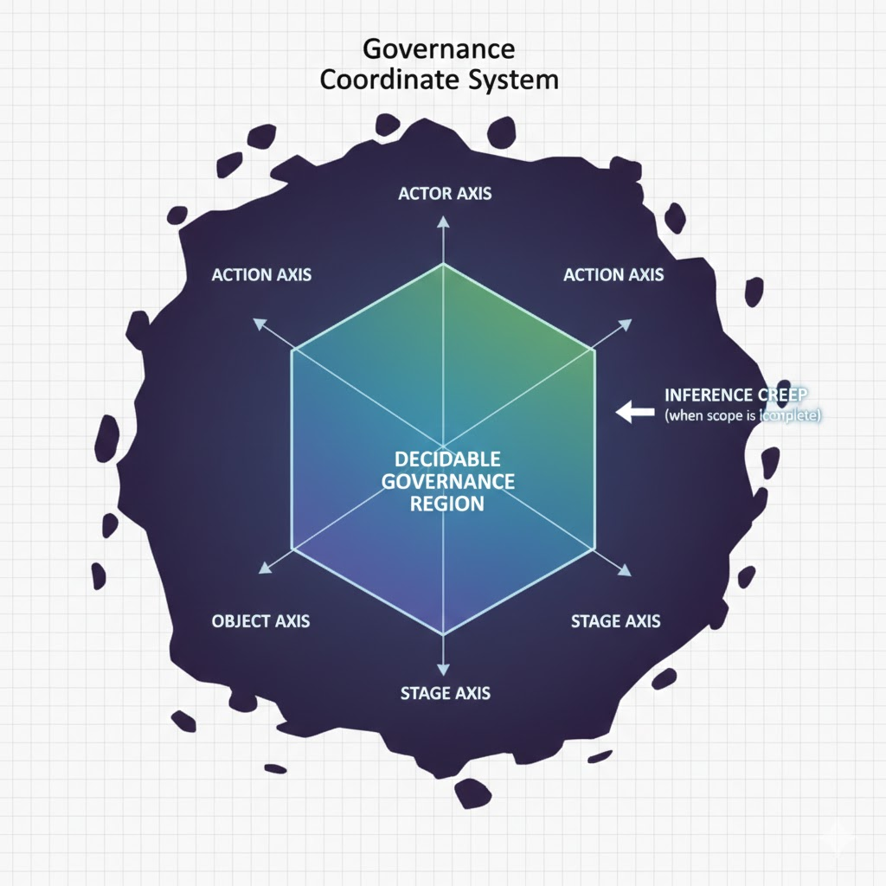

# Scope as a Governance Primitive

## 1. Introduction

Contemporary discussions of AI governance frequently emphasize ethical principles, risk controls, audit mechanisms, and post-hoc accountability. These discussions implicitly assume that governance statements are applicable to the systems and behaviors they claim to regulate. In practice, this assumption often fails.

This paper argues that a significant class of governance failures does not originate from insufficient rules or weak enforcement, but from a more fundamental structural omission: the absence of an explicitly defined **Scope**. When scope is undefined, governance statements become logically undecidable. They cannot be evaluated as satisfied or violated, because it is unclear _to what_ and _when_ they apply.

We propose that **Scope** is not a secondary annotation or contextual detail, but a first-order **governance primitive**. Without scope, governance cannot be activated, enforced, or audited. The lack of scope gives rise to structural failure modes such as decision vacancy and inference creep, which are often misdiagnosed as implementation defects rather than governance design errors.

---

## 2. Governance Primitives and Structural Decidability

We distinguish between **governance primitives** and **governance outcomes**. Governance primitives are declarative, static elements that can be defined independently of execution. Governance outcomes, by contrast, emerge dynamically during system operation and cannot be meaningfully declared in advance.

A governance primitive must satisfy three criteria:

1. It must be declarable as a static artifact.
2. Its absence must result in a specific, diagnosable governance failure.
3. Its presence must enable structural observability rather than narrative interpretation.

Within this framework, Scope qualifies as a governance primitive because it determines whether governance statements are **decidable**. A governance claim without scope cannot be evaluated as true or false; it collapses into an interpretive assertion.

---

## 3. Defining Scope

We define **Scope** as the minimal set of conditions required to determine the applicability of a governance constraint.

Formally, a governance scope  $\mathcal{S}$  is defined as a quadruple:

$$
\mathcal{S} = \langle \text{Actor}, \text{Action}, \text{Object}, \text{Stage} \rangle
$$

Where:

- **Actor** identifies the entity whose behavior is subject to governance.
- **Action** identifies the class of actions under consideration.
- **Object** identifies the artifact or target affected by the action.
- **Stage** identifies the lifecycle phase in which the action occurs.

This definition is intentionally minimal. Each component is irreducible: removing any element renders the scope incomplete and governance undecidable.

> **Figure X. Governance Coordinate System and Decidable Scope.**
This figure conceptualizes Scope as a governance coordinate system defined by Actor, Action, Object, and Lifecycle Stage axes. Only behaviors located within the fully specified coordinate space form a decidable governance region. When one or more axes are undefined or implicit, governance applicability collapses, allowing inference creep to emerge as semantic drift rather than as a detectable violation.

---

## 4. Structural Completeness and Decidability

We define **structural completeness of scope** as follows:

A scope  $\mathcal{S}$  is structurally complete if and only if all four components are explicitly defined and non-empty.

Let  $\text{IsDefined}(\mathcal{S})$  be a predicate over governance scope:

$$
\text{IsDefined}(\mathcal{S}) \iff (\text{Actor} \neq \emptyset) \wedge (\text{Action} \neq \emptyset) \wedge (\text{Object} \neq \emptyset) \wedge (\text{Stage} \neq \emptyset)
$$

If  $\text{IsDefined}(\mathcal{S}) = \text{false}$ , then any governance evaluation function  $E(\mathcal{S})$  yields an undefined result.

This property distinguishes governance from compliance rhetoric. A governance statement that cannot be evaluated is not weak governance; it is **non-governance**.

---

## 5. Scope Versus Boundary

Scope is frequently conflated with boundary conditions. We explicitly separate the two.

- **Scope** determines _where_ governance applies.
- **Boundary** determines _what is permitted or prohibited_ within that scope.

Boundary presupposes scope. Without scope, boundary definitions lack a reference frame and cannot be enforced or audited. Conversely, scope without boundary defines applicability but does not constrain behavior.

This distinction is critical: many systems declare boundaries without declaring scope, producing an illusion of governance that fails under audit.

---

## 6. Scope Absence as a Structural Failure

When scope is absent or incomplete, governance systems exhibit predictable failure modes:

1. **Decision Vacancy**: Decisions are deferred to implementers or systems due to lack of applicability criteria.
2. **Non-Decidable Governance Claims**: Governance statements cannot be evaluated against concrete behavior.
3. **Inference Creep**: Behavioral expansion occurs in undefined regions without being classified as violations.

These failures are not anomalies. They are structural consequences of missing scope.

---

## 7. Discussion

Reframing scope as a governance primitive shifts governance analysis from enforcement strength to structural validity. The primary question becomes not “Are the rules strict enough?” but “Are the rules applicable at all?”

Scope does not enforce governance. It enables governance to exist.

Subsequent governance primitives—boundary, constraint, and evidence—depend on scope for their own decidability. Without scope, governance systems cannot distinguish compliance from deviation, or control from drift.

---

## 8. Conclusion

This paper establishes scope as a first-order governance primitive necessary for decidable AI governance. We show that many governance failures attributed to enforcement or implementation are in fact consequences of missing or incomplete scope.

Future work will examine boundary as a complementary governance primitive and analyze how default logic determines the emergence of inference creep in partially scoped systems.
